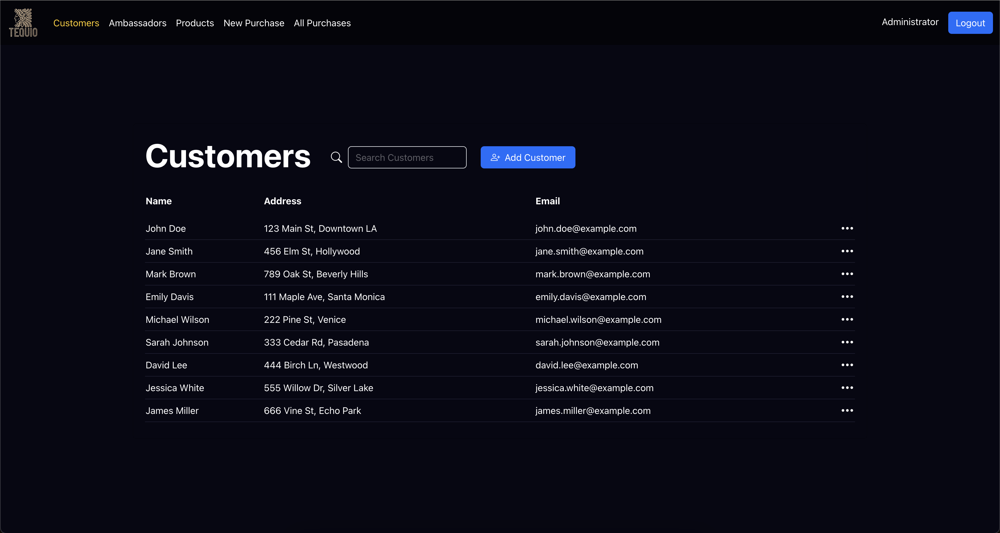
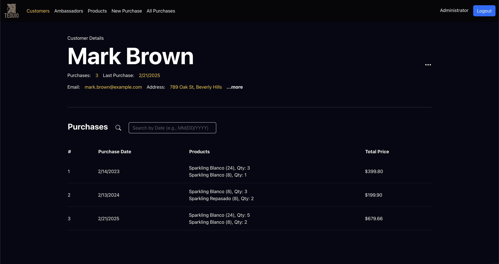
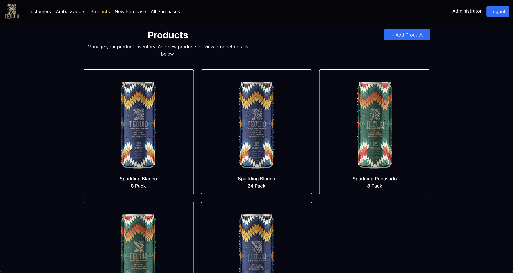
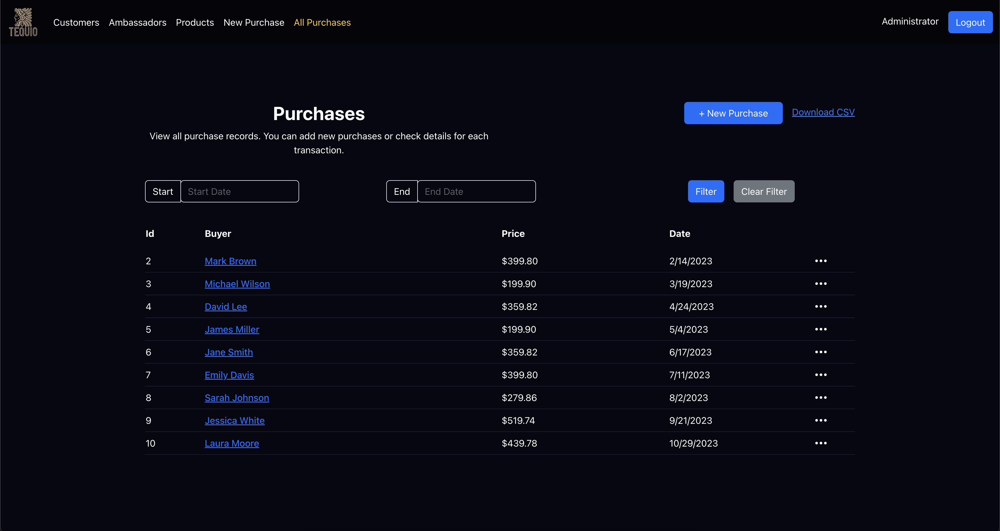

# Tequio Business Management Platform

**TequioDemoTrack** is a web-based business management application designed to centralize operations for tracking customer demographics, managing employees, monitoring purchases, and organizing products. This project highlights my ability to develop robust, full-stack applications that balance user experience with operational functionality.

---

## Key Features

### **Customer and Employee Management**
- View, create, update, and delete records for customers and employees.
- Search and filter data intuitively to quickly find relevant information.
- Track employee activity and customer engagement.

### **Export Data to CSV**
- Easily download customer, product, or purchase data as a CSV file for reporting and analysis.

### **Purchase and Product Management**
- Maintain a detailed record of purchases with associated products.
- Organize products by name, pack size, and availability.
- Monitor and analyze purchase trends.

### **Advanced Search and Filtering**
- Search functionality for filtering records by date, name, or other attributes.
- Ensure quick access to critical data.

### **Responsive and Intuitive Design**
- Fully responsive design optimized for desktop and mobile.
- Clean and modern UI to enhance usability and navigation.

---

## Technologies Used 

### **Frontend**
- **React.js**: Built dynamic user interfaces with state management.
- **Reactstrap**: Styled components for a polished, professional look.

### **Backend**
- **.NET Core**: Developed a robust API for managing application data.
- **Entity Framework**: Handled database operations with structured models.

### **Database**
- **SQL Server**: Stored and managed relational data.

### **Tools & Testing**
- **Postman**: Tested API endpoints for reliability.
- **Visual Studio & VS Code**: Tools for development and debugging.

---

## Highlights

- **Comprehensive Data Management**: Designed a system for handling interrelated entities, including customers, employees, products, and purchases.
- **User-Centric Design**: Focused on creating a seamless experience with accessible features.
- **Reusability**: Implemented modular and reusable components for maintainability.

---

## Why I Built This

Tequio reflects my ability to combine functionality and design to create practical tools for business management. It’s an all-in-one platform to streamline operations and demonstrates my passion for building solutions that make a difference.

---

## Future Enhancements

- **Analytics Dashboard**: Visualize business data through charts and graphs.
- **Notifications**: Real-time alerts for important updates.

---

## About Me

I’m Ben Merlotti, a creative individual with a passion for building applications that combine functionality and aesthetic design. Tequio showcases my skills in full-stack development and my dedication to solving real-world problems through technology.

Feel free to connect with me on [LinkedIn](https://www.linkedin.com/in/benmerlotti/)

